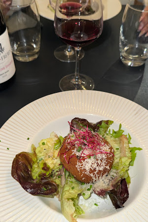
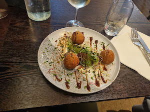
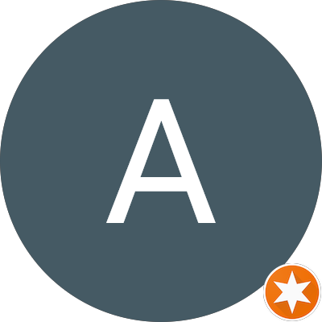
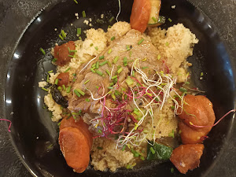

# Refonte carousel témoignages — Layout Option B (Split asymétrique)

## Contexte

Site L'Épopée (restaurant Tours). La section témoignages actuelle du carousel a un problème de cohérence visuelle : les images de plats ont des ratios différents (300×225 horizontal pour Antoine et Lucile, 300×450 vertical pour Enzo), ce qui casse l'harmonie d'un slide à l'autre. L'image prend aussi trop de place par rapport au texte qui devrait être le cœur d'un témoignage.

**Objectif** : refondre le layout en split 35/65 (image fixe à gauche, contenu éditorial à droite) avec `background-image` + `background-size: cover` pour normaliser les ratios quelle que soit la taille native de l'image.

## Fichiers à modifier

- `index.html` — remplacer le HTML de la section `#testi-carousel` (ne modifier QUE cette section)
- `style.css` — remplacer le bloc CSS `.testi-*` existant (lignes ~875–1044, tout le bloc carousel témoignages)
- `main.js` — **NE PAS MODIFIER** — la logique JS (IDs `testi-track`, `testi-prev`, `testi-next`, `testi-dots`, classes `.testi-slide`, `.testi-dot`, `.is-active`) doit être préservée à l'identique

## Design system à respecter

Utiliser les tokens existants du `:root` :

- `--color-cta: #D62828` pour les étoiles et accents
- `--color-bg: #FAF6F1` fond de page
- `--color-text: #1A1A1A` texte principal
- `--color-muted: #6b6b6b` méta, textes secondaires
- `--color-border-light: rgba(0, 0, 0, 0.1)` bordures
- `--font-display: 'Fraunces'` titres et nom de l'auteur
- `--font-body: 'Inter'` corps et méta

## Spécifications visuelles

### Structure du slide (desktop ≥810px)

Grid 2 colonnes : image à gauche 280px fixe, contenu à droite flexible.

- Conteneur `.testi-slide` : `display: grid`, `grid-template-columns: 280px 1fr`, hauteur min 360px, `overflow: hidden`, bordure 1px `--color-border-light`, `border-radius: 4px`, fond blanc
- Retirer tout `padding` du conteneur slide (le padding passe dans `.testi-slide__content`)
- Retirer le `gap: 32px` actuel

### Image (gauche)

- `.testi-slide__image` devient un `` qui remplit tout son conteneur via `object-fit: cover` et `object-position: center`
- Largeur 280px, hauteur 100% (min 360px)
- Supprimer la bordure et le border-radius de l'image elle-même (gérés par le parent)
- L'image doit toujours rester un `` pour l'accessibilité (alt) et le lazy loading, pas un div avec background-image

### Contenu (droite)

Padding interne `40px 36px`, flex column, gap 16px :

1. **Ligne étoiles + date** : flex row, gap 12px, baseline aligned
   - Étoiles : `color: var(--color-cta)`, letter-spacing 2px, font-size 14px
   - Séparateur `·` en `--color-muted`
   - Date : `--color-muted`, font-size 13px
2. **Titre** `.testi-slide__title` : Fraunces 26px, weight 500, line-height 1.3, `letter-spacing: -0.3px`
3. **Texte** `.testi-slide__text` : Inter 15px, line-height 1.65, color `--color-text` (pas `--color-muted`, on veut le texte lisible comme contenu principal)
4. **Bloc profil en bas** `.testi-slide__profile` :
   - `margin-top: auto` pour le coller au bas de la zone contenu
   - `padding-top: 20px` + `border-top: 1px solid var(--color-border-light)`
   - Avatar 44px rond + nom 14px weight 500 + sous-texte "Client vérifié" ou équivalent en 12px `--color-muted`
   - **Supprimer** l'affichage des étoiles et de la date dans ce bloc (déjà remontés en haut)

### Responsive (≤809px)

- Grid passe en 1 colonne
- Image : hauteur 240px, largeur 100%, `object-fit: cover`
- Contenu : padding 28px 24px
- Titre : 22px
- Texte : 14px

## HTML cible

Remplacer le contenu HTML de `#testi-carousel` par cette structure (garder les IDs et classes de navigation identiques pour préserver le JS) :

```html
<div class="testi-carousel fade-in" id="testi-carousel">
  <div class="testi-carousel__viewport">
    <div class="testi-carousel__track" id="testi-track">

      <!-- Avis 1 — Enzo CHARPENTIER -->
      <article class="testi-slide">
        
        <div class="testi-slide__content">
          <div class="testi-slide__meta-top">
            <span class="testi-slide__stars" aria-label="5 étoiles sur 5">★★★★★</span>
            <span class="testi-slide__sep" aria-hidden="true">·</span>
            <span class="testi-slide__date">il y a 6 mois</span>
          </div>
          <h3 class="testi-slide__title">Une belle adresse à Tours</h3>
          <p class="testi-slide__text">L'Épopée est une vraie réussite. La cuisine y est excellente, inventive sans en faire trop, et toujours préparée avec des produits frais et de saison. La carte change chaque mois, ce qui permet de découvrir régulièrement de nouvelles saveurs. Le service est remarquable : attentionné, efficace, et surtout humain.</p>
          <div class="testi-slide__profile">
            
            <div>
              <div class="testi-slide__name">Enzo Charpentier</div>
              <div class="testi-slide__author-meta">Client vérifié</div>
            </div>
          </div>
        </div>
      </article>

      <!-- Avis 2 — Antoine -->
      <article class="testi-slide">
        
        <div class="testi-slide__content">
          <div class="testi-slide__meta-top">
            <span class="testi-slide__stars" aria-label="5 étoiles sur 5">★★★★★</span>
            <span class="testi-slide__sep" aria-hidden="true">·</span>
            <span class="testi-slide__date">il y a 3 mois</span>
          </div>
          <h3 class="testi-slide__title">Une ambiance chaleureuse et une cuisine de qualité</h3>
          <p class="testi-slide__text">Un très agréable moment passé dans ce restaurant. Situé dans une rue calme du centre-ville, vous pourrez y retrouver une ambiance chaleureuse et une cuisine de qualité. Le serveur est très sympa, souriant et connaît bien sa carte. Je recommande sans hésiter et reviendrai prochainement à coup sûr.</p>
          <div class="testi-slide__profile">
            
            <div>
              <div class="testi-slide__name">Antoine</div>
              <div class="testi-slide__author-meta">Client vérifié</div>
            </div>
          </div>
        </div>
      </article>

      <!-- Avis 3 — Lucile -->
      <article class="testi-slide">
        
        <div class="testi-slide__content">
          <div class="testi-slide__meta-top">
            <span class="testi-slide__stars" aria-label="5 étoiles sur 5">★★★★★</span>
            <span class="testi-slide__sep" aria-hidden="true">·</span>
            <span class="testi-slide__date">il y a 10 mois</span>
          </div>
          <h3 class="testi-slide__title">Superbe découverte</h3>
          <p class="testi-slide__text">Nous avons été très bien accueillis, le service était exceptionnel et les plats très bien cuisinés. Les saveurs sont au rendez-vous et les portions bien dosées. Nous avons passé un très bon moment et nous nous sommes régalés, donc nous avons hâte de voir la prochaine carte pour revenir.</p>
          <div class="testi-slide__profile">
            
            <div>
              <div class="testi-slide__name">Lucile</div>
              <div class="testi-slide__author-meta">Client vérifié</div>
            </div>
          </div>
        </div>
      </article>

    </div>
  </div>

  <!-- Nav : flèches + dots (structure et IDs préservés pour le JS) -->
  <div class="testi-carousel__nav">
    <button class="testi-arrow" id="testi-prev" aria-label="Avis précédent">
      <svg viewBox="0 0 24 24" fill="none" stroke="currentColor" stroke-width="2"><path d="M15 18l-6-6 6-6"></path></svg>
    </button>
    <div class="testi-carousel__dots" id="testi-dots">
      <button class="testi-dot is-active" aria-label="Avis 1"></button>
      <button class="testi-dot" aria-label="Avis 2"></button>
      <button class="testi-dot" aria-label="Avis 3"></button>
    </div>
    <button class="testi-arrow" id="testi-next" aria-label="Avis suivant">
      <svg viewBox="0 0 24 24" fill="none" stroke="currentColor" stroke-width="2"><path d="M9 18l6-6-6-6"></path></svg>
    </button>
  </div>
</div>
```

**Notes HTML importantes** :
- Retirer l'attribut `style="transition:..."` inline sur `#testi-track` (c'est le JS qui le pose à l'init)
- Retirer les attributs `width` / `height` hardcodés sur les images (la CSS gère)
- Le premier dot doit être `is-active` (pas le troisième comme actuellement)
- Attribut `alt=""` sur les avatars (décoratif — le nom est déjà en texte à côté)

## CSS cible

Remplacer **intégralement** le bloc qui va de `.testi-carousel {` (ligne ~875) jusqu'à la fermeture du dernier `@media (max-width: 809px)` du carousel (ligne ~1044), par :

```css
/* ========================================
   TESTIMONIALS — Layout B (split asymétrique)
   ======================================== */
.testi-carousel {
  width: 100%;
  display: flex;
  flex-direction: column;
  gap: 32px;
}

.testi-carousel__viewport {
  width: 100%;
  overflow: hidden;
  border-radius: 4px;
}

.testi-carousel__track {
  display: flex;
  width: 100%;
}

/* Slide : grid 2 colonnes — image fixe 280px + contenu flexible */
.testi-slide {
  flex: 0 0 100%;
  min-width: 100%;
  display: grid;
  grid-template-columns: 280px 1fr;
  min-height: 360px;
  border: 1px solid var(--color-border-light);
  border-radius: 4px;
  background: var(--color-light);
  overflow: hidden;
  box-sizing: border-box;
}

/* Image : remplit sa colonne, ratio normalisé via object-fit */
.testi-slide__image {
  width: 100%;
  height: 100%;
  object-fit: cover;
  object-position: center;
  display: block;
  border-radius: 0;
  border: none;
}

/* Contenu : padding interne, flex column */
.testi-slide__content {
  display: flex;
  flex-direction: column;
  gap: 16px;
  padding: 40px 36px;
  min-width: 0;
}

/* Ligne méta en haut : étoiles + date */
.testi-slide__meta-top {
  display: flex;
  align-items: baseline;
  gap: 10px;
  font-family: var(--font-body);
}
.testi-slide__stars {
  color: var(--color-cta);
  letter-spacing: 2px;
  font-size: 14px;
}
.testi-slide__sep {
  color: var(--color-muted);
  font-size: 14px;
}
.testi-slide__date {
  color: var(--color-muted);
  font-size: 13px;
}

/* Titre */
.testi-slide__title {
  font-family: var(--font-display);
  font-size: 26px;
  font-weight: 500;
  line-height: 1.3;
  letter-spacing: -0.3px;
  color: var(--color-text);
}

/* Texte principal */
.testi-slide__text {
  font-family: var(--font-body);
  font-size: 15px;
  line-height: 1.65;
  color: var(--color-text);
}

/* Bloc profil en bas */
.testi-slide__profile {
  display: flex;
  align-items: center;
  gap: 12px;
  margin-top: auto;
  padding-top: 20px;
  border-top: 1px solid var(--color-border-light);
}
.testi-slide__avatar {
  width: 44px;
  height: 44px;
  border-radius: 50%;
  object-fit: cover;
  flex-shrink: 0;
  border: 1px solid var(--color-border-light);
}
.testi-slide__name {
  font-family: var(--font-display);
  font-size: 15px;
  font-weight: 500;
  color: var(--color-text);
  line-height: 1.2;
}
.testi-slide__author-meta {
  font-family: var(--font-body);
  font-size: 12px;
  color: var(--color-muted);
  margin-top: 2px;
}

/* Navigation (inchangée — conservée telle quelle) */
.testi-carousel__nav {
  display: flex;
  align-items: center;
  justify-content: center;
  gap: 16px;
}
.testi-arrow {
  width: 44px;
  height: 44px;
  border-radius: 50%;
  border: 1px solid var(--color-border-light);
  background: transparent;
  display: flex;
  align-items: center;
  justify-content: center;
  cursor: pointer;
  color: var(--color-text);
  transition: background 0.2s ease, color 0.2s ease, border-color 0.2s ease;
}
.testi-arrow:hover {
  background: var(--color-cta);
  color: var(--color-light);
  border-color: var(--color-cta);
}
.testi-arrow svg { width: 20px; height: 20px; }

.testi-carousel__dots {
  display: flex;
  align-items: center;
  gap: 8px;
}
.testi-dot {
  width: 8px;
  height: 8px;
  border-radius: 50%;
  border: none;
  background: var(--color-border-light);
  cursor: pointer;
  padding: 0;
  transition: background 0.2s ease, width 0.2s ease;
}
.testi-dot.is-active {
  background: var(--color-cta);
  width: 24px;
  border-radius: 4px;
}

/* Responsive ≤ 809px : stack vertical */
@media (max-width: 809px) {
  .testi-slide {
    grid-template-columns: 1fr;
    min-height: auto;
  }
  .testi-slide__image {
    height: 240px;
    width: 100%;
  }
  .testi-slide__content {
    padding: 28px 24px;
    gap: 14px;
  }
  .testi-slide__title {
    font-size: 22px;
  }
  .testi-slide__text {
    font-size: 14px;
  }
  .testi-slide__avatar {
    width: 40px;
    height: 40px;
  }
}
```

## Checklist de vérification post-implémentation

À vérifier après modification, en testant en local et en comparant avec des screenshots :

- [ ] Les 3 slides s'affichent avec la même hauteur et la même largeur (cohérence visuelle)
- [ ] Les 3 images de plats s'affichent sans déformation malgré leurs ratios natifs différents (Enzo 300×450 vertical et les 2 autres 300×225 horizontales)
- [ ] Le carousel continue de fonctionner : clic sur flèches, clic sur dots, autoplay toutes les 8s, pause au hover
- [ ] Le premier dot est bien `is-active` au chargement (slide Enzo visible par défaut)
- [ ] Les étoiles rouges `#D62828` s'affichent en haut de chaque slide
- [ ] Le bloc profil (avatar + nom + "Client vérifié") est bien collé au bas de la zone contenu, pas flottant au milieu
- [ ] Le texte de l'avis est bien noir lisible, pas gris (contenu principal)
- [ ] Sur mobile (<810px), le layout passe en stack vertical : image 240px en haut, contenu en dessous
- [ ] L'accessibilité est préservée : `aria-label` sur les étoiles, `alt` descriptifs sur les photos de plats, `alt=""` sur les avatars décoratifs
- [ ] La classe `fade-in` fonctionne toujours pour l'animation d'apparition au scroll
- [ ] Aucune régression visuelle sur les autres sections du site

## Points d'attention

1. **Ne pas toucher au JS** — toute la logique (`main.js` section "Testimonial carousel") fonctionne déjà. Les IDs et les noms de classes utilisés dans les sélecteurs (`#testi-track`, `.testi-slide`, `.testi-dot.is-active`, etc.) sont conservés à l'identique.

2. **Object-fit sur l'image** — c'est la clé du layout. L'image Enzo (verticale 300×450) sera croppée en haut et en bas, les 2 autres (300×225) seront croppées à gauche/droite. Vérifier que rien d'important n'est coupé. Si nécessaire, ajuster `object-position` par image (par ex. `object-position: center 30%` sur l'image verticale pour favoriser le centre-haut).

3. **Cohérence typo** — le nom de l'auteur passe en Fraunces (serif) pour un ton plus éditorial, le reste reste en Inter.

4. **Pas d'italique sur le titre** (j'ai volontairement évité le risque de ton "faux luxe" — on reste sobre et lisible).

5. **"Client vérifié"** — formulation neutre. Si tu veux remplacer par "Avis Google", "Avis TripAdvisor", ou la source réelle, remplacer le texte dans les 3 slides.
